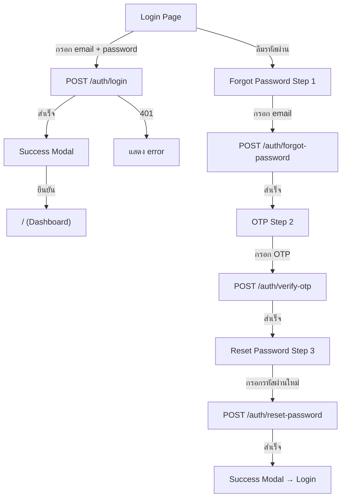

# Module 0: Authentication — Walkthrough

## สรุปสิ่งที่ทำ

สร้าง Module 0: Authentication ครบทุก task ตาม DEVELOPMENT_PLAN.md โดยอิงจาก Figma Design

---

## ไฟล์ทั้งหมดใน Module 0

### ✅ Infrastructure (Task 0.1–0.3)

| File | หน้าที่ | สถานะ |
|------|---------|-------|
| [client.ts](file:///e:/work/codes/sudyod_mortor_fe/src/api/client.ts) | Axios instance + JWT interceptors + refresh token queue | ✅ พร้อม |
| [auth.ts](file:///e:/work/codes/sudyod_mortor_fe/src/types/auth.ts) | TypeScript types (Login, ForgotPassword, OTP, Reset, Employee, Session) | ✅ พร้อม |
| [api.ts](file:///e:/work/codes/sudyod_mortor_fe/src/types/api.ts) | Generic API/Paginated response types | ✅ พร้อม |
| [authService.ts](file:///e:/work/codes/sudyod_mortor_fe/src/api/authService.ts) | Auth API service (login, logout, refresh, forgot, OTP, reset, me, sessions) | ✅ พร้อม |
| [authStore.ts](file:///e:/work/codes/sudyod_mortor_fe/src/stores/authStore.ts) | Zustand store (login, logout, fetchMe, checkAuth) | ✅ พร้อม |
| [schemas.ts](file:///e:/work/codes/sudyod_mortor_fe/src/features/auth/schemas.ts) | Zod validation schemas (login, forgot, OTP, reset) | ✅ พร้อม |

### ✅ Pages & Components (Task 0.4–0.7)

| File | หน้าที่ | สถานะ |
|------|---------|-------|
| [LoginPage.tsx](file:///e:/work/codes/sudyod_mortor_fe/src/pages/LoginPage.tsx) | หน้า Login ตาม Figma + password toggle + success modal | ✅ ปรับปรุงแล้ว |
| [ForgotPasswordPage.tsx](file:///e:/work/codes/sudyod_mortor_fe/src/pages/ForgotPasswordPage.tsx) | 3-step flow: ตั้งค่ารหัสผ่าน → OTP → เปลี่ยนรหัสผ่าน | ✅ ปรับปรุงแล้ว |
| [ProtectedRoute.tsx](file:///e:/work/codes/sudyod_mortor_fe/src/routes/ProtectedRoute.tsx) | Route guard + loading spinner | ✅ พร้อม |
| [index.tsx](file:///e:/work/codes/sudyod_mortor_fe/src/routes/index.tsx) | Route configuration (/login, /forgot-password, /) | ✅ พร้อม |

### ✅ Styling & Assets

| File | หน้าที่ | สถานะ |
|------|---------|-------|
| [globals.css](file:///e:/work/codes/sudyod_mortor_fe/src/styles/globals.css) | Design tokens + auth-specific styles + animations | ✅ สร้างใหม่ |
| [logo.svg](file:///e:/work/codes/sudyod_mortor_fe/public/logo.svg) | โลโก้ สุดยอด (red badge) | ✅ สร้างใหม่ |

---

## ผลลัพธ์ UI

### Login Page


### Login Page (กรอก + Password Toggle)
````carousel

<!-- slide -->

````

---

## Design Features ที่ตรงกับ Figma

| Feature | รายละเอียด |
|---------|-----------|
| 🎨 Color Scheme | Dark buttons (#1F2937), red logo (#DC2626), gray background gradient |
| 🔤 Typography | Noto Sans Thai font, proper weight hierarchy |
| 👁️ Password Toggle | Eye/EyeOff icon สลับแสดง/ซ่อนรหัสผ่าน |
| ✅ Success Modal | Modal overlay + green check icon animation |
| 📊 Step Indicator | 3 dots แสดง progress ของ forgot password flow |
| ⬅️ Back Navigation | ปุ่มย้อนกลับในแต่ละ step |
| 🎭 Animations | Card slide-up, fade-in, shake on error |
| 📱 Responsive | Centered card layout, max-width 28rem |

---

## Auth Flow



## Verification

- ✅ `npm run build` — สำเร็จ ไม่มี TypeScript errors
- ✅ `npm run dev` — Server ทำงานที่ http://localhost:5173
- ✅ Login page แสดงผลถูกต้อง ตรงกับ Figma
- ✅ Password toggle ทำงาน
- ✅ Forgot password navigation ทำงาน
